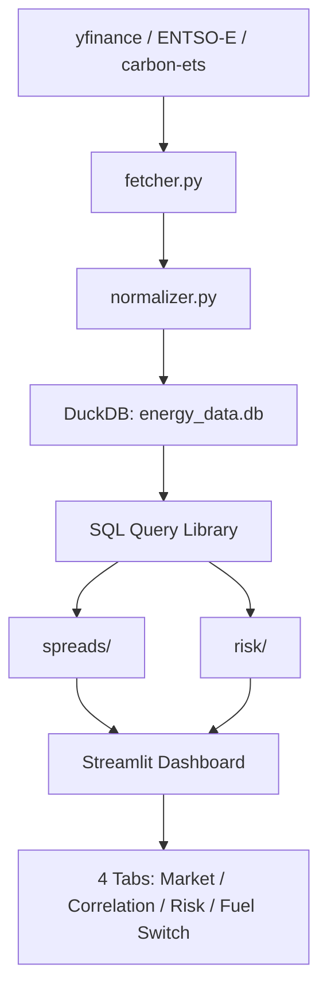

# Energy Cross-Commodity Trading Analytics Platform

Cross-commodity energy trading analytics covering **Brent crude, TTF natural gas, EUA carbon, and European power**. Built for the Equinor Market Analysis & Trading Graduate Programme.

## Architecture



## Quickstart

```bash
# Install
poetry install

# Run data pipeline (fetches real market data)
poetry run python -m energy_cross_commodity.pipeline

# Launch dashboard
poetry run streamlit run src/energy_cross_commodity/dashboard/app.py

# Run tests
poetry run pytest tests/ -v
```

## Modules

| Module | Description |
|--------|-------------|
| `data/` | Multi-source data pipeline (yfinance, ENTSO-E, carbon-ets) into DuckDB |
| `spreads/` | Clean spark spread, dark spread, 3-2-1 crack spread, fuel-switching signal |
| `risk/` | Univariate GARCH, rolling/DCC correlation, t-copula, multi-commodity VaR/ES, stress scenarios |
| `dashboard/` | 4-tab Streamlit app with KTH theme |
| `sql/` | Version-controlled parameterized SQL query library |
| `config/` | Hydra YAML configuration for all parameters |

## Data Sources

| Commodity | Source | Coverage |
|-----------|--------|----------|
| Brent Crude | ICE (yfinance `BZ=F`) | 2019-present |
| TTF Gas | ICE/EEX (yfinance proxy) | 2019-present |
| EUA Carbon | EEX auctions (carbon-ets) | 2012-present |
| German Power | ENTSO-E Transparency | 2019-present |
| Nord Pool | ENTSO-E / Nord Pool | 2019-present |
| RBOB, Gasoil, Coal | yfinance | 2019-present |

## Key Findings

- **Aug 2022 Spark Spread Inversion:** CSS dropped below -200 EUR/MWh as TTF spiked to 300+ EUR/MWh. Gas plants were deeply unprofitable; coal ramped despite carbon costs.
- **Fuel Switching:** At 100 EUR/t carbon, gas has a ~170 EUR/MWh carbon-cost advantage over coal due to lower emissions intensity.
- **Tail Dependence:** t-copula with df=5 captures joint extremes that a Gaussian model misses. TTF-power tail dependence hit ~0.40 during the 2022 crisis.
- **Carbon Pass-Through:** EU ETS carbon costs flow through to power prices at 80-100% empirically.

## Stack

Python 3.12+, Poetry, DuckDB, arch, scipy, Streamlit, Plotly, Hydra, pytest
