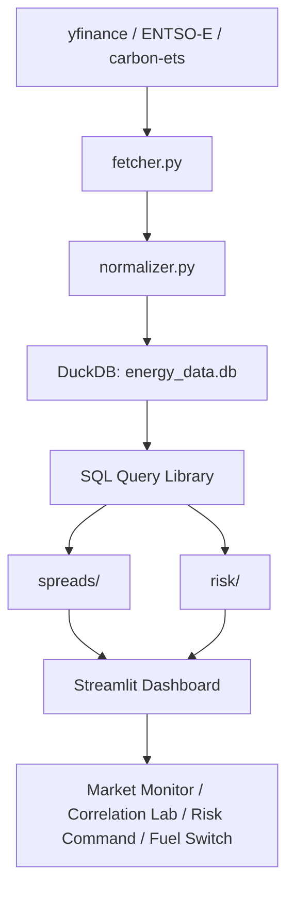

# Energy Cross-Commodity Trading Analytics

A cross-commodity energy trading analytics platform covering Brent crude, TTF natural gas, EUA carbon allowances, and European power markets. The platform models the economic linkages between these markets: how carbon prices drive fuel switching between gas and coal generation, how the resulting merit-order dynamics flow through to power prices, and how correlations between commodities shift during market crises. Built with real market data from ICE, EEX, and ENTSO-E.

The analytics engine combines univariate GARCH volatility models, dynamic conditional correlation (DCC-GARCH), multivariate t-copula simulation, and Euler-allocated value-at-risk. The Streamlit dashboard presents four analytical views: market monitoring, correlation analysis, risk decomposition, and fuel-switching economics.

## Why These Markets Move Together

European energy markets do not clear independently. A gas supply shock propagates through multiple channels:

1. **Gas-to-power pass-through.** Natural gas-fired plants set the marginal electricity price during a substantial share of hours in Germany, so when TTF rises German day-ahead power tends to follow. The pass-through rate, estimated as a regression beta of power returns on gas returns, turns out to depend heavily on the frequency at which it is measured. On this sample (2020-01-02 to 2026-08-05) the annual daily-return beta ranges from 0.04 to 0.45, while the same regression at weekly frequency gives 1.18 for 2022 and at monthly frequency 1.57. Day-ahead power is dominated by weather and renewable output, so the fuel-cost signal only dominates once those transient effects average out. Quoting a single pass-through number without stating the frequency is meaningless.

2. **Carbon-to-power pass-through.** Under the EU Emissions Trading System, generators must surrender allowances for each tonne of CO2 emitted. A €10/t increase in EUA prices adds approximately €3.70/MWh to the marginal cost of a 55%-efficient combined-cycle gas turbine and roughly €9.00/MWh for a 38%-efficient coal plant. Those figures are cost-accounting identities from emission factors and thermal efficiencies, not estimates. The empirical counterpart does not survive contact with the data: regressing German power returns on EUA returns over the full sample gives a beta of -0.15, and the rolling 60-day beta swings from -1.06 to 0.87 across its 10th and 90th percentiles. Carbon is a small and slow-moving component of marginal cost relative to daily weather and renewable shocks, so daily returns cannot identify it. The platform therefore treats carbon pass-through as a cost input to the spread calculations rather than as an estimated coefficient.

3. **Fuel switching.** The clean spark spread (CSS) and clean dark spread (CDS) measure the profitability of gas and coal generation respectively, net of fuel and carbon costs. When CSS exceeds CDS, gas is the cheaper marginal fuel and tends to set the power price. At €100/t carbon, a modern CCGT has a carbon-cost advantage of roughly €53/MWh over a hard-coal plant (€37/MWh versus €90/MWh), because coal emits approximately 2.5 times more CO2 per MWh of electricity generated. The platform tracks this fuel-switching signal daily and identifies the break-even carbon price at which the two technologies are equally profitable.

4. **Correlation regime shifts.** The gas-power correlation is far weaker at daily frequency than the physical link suggests, and it moves. Over the full sample the daily displaced-log-return correlation between TTF and German baseload is 0.09; the rolling 60-day correlation averages -0.01 across 2020-2021, peaks at 0.45 on 2022-01-25 during the gas crisis, and settles back to 0.07 through 2025. The same correlation measured on lower-frequency returns rises monotonically — 0.09 daily, 0.34 weekly, 0.45 monthly, 0.49 quarterly — which is the Epps effect: microstructure and weather noise swamp the common fuel-cost factor at short horizons. A covariance matrix estimated from a calm period therefore understates crisis risk, which is the case for the DCC-GARCH specification used here over a static estimate.

## Architecture



The pipeline fetches data from three sources — yfinance for financial futures (Brent, TTF, RBOB, Gasoil, API2 coal, EURUSD), ENTSO-E Transparency Platform for day-ahead power prices (German and Nordic bidding zones), and EEX auction reports for EUA carbon prices. Each source has an independent adapter in `fetcher.py` that returns a standardised DataFrame. The normalizer converts all prices to EUR/MWh for cross-commodity comparison while preserving native units for spread calculations that require them.

DuckDB serves as the sole data store. All analytics modules read from it through a version-controlled SQL query library in `sql/`. The dashboard queries the database live — there are no static CSV exports or pre-rendered charts.

## Dashboard

| Tab 1 — Market Monitor | Tab 2 — Correlation Lab |
|:---:|:---:|
|  |  |
| *Price return heatmap (20-day, commodities × dates), normalized price index rebased to 100 at January 2022, and a three-panel spread dashboard showing clean spark spread, clean dark spread, and fuel-switching signal.* | *Rolling 60-day TTF-German power correlation with annotated crisis events. Interactive date-picker correlation matrix. t-copula versus Gaussian 95% contour comparison. Frobenius-norm-based regime classification.* |

| Tab 3 — Risk Command | Tab 4 — Fuel Switch |
|:---:|:---:|
|  |  |
| *Euler-allocated component VaR from 10,000 t-copula draws. P&L backtest with VaR 95% band and breach markers, scored live by Kupiec and Christoffersen. Stress scenario P&L waterfall. Cumulative portfolio P&L trajectory with Sharpe ratio and maximum drawdown.* | *Fuel-switching signal (CSS − CDS) with gas/coal/zone bands and regime-day counts. Rolling 60-day carbon pass-through beta, shaded with its own realised 10th-90th percentile band rather than a textbook range. STL seasonal decomposition of the 3-2-1 crack spread. Break-even carbon price versus actual EUA with gas-favored and coal-favored shading.* |


## Notebooks — Deep-Dive Analytics

Four Jupyter notebooks provide the theoretical foundation, regulatory context, and detailed methodology behind each dashboard view. Each notebook is self-contained: it can be read standalone or as part of the progressive narrative from market data through spreads, correlations, and portfolio risk. All notebooks include executive summaries, formal derivations, academic citations, and references to the relevant EU regulations (REMIT II, MiFID II, EMIR, EU ETS Directive).

| # | Notebook | Covers | PDF |
|---|----------|--------|-----|
| 1 | **Market Landscape** | Market microstructure (trading venues, desk-level exposure), data pipeline, summary statistics with Jarque-Bera normality tests, normalised price paths, log-return distributions with normal overlays, rolling volatility regimes, ADF stationarity tests | [PDF](docs/notebooks/01_market_landscape.pdf) |
| 2 | **Spread Economics** | EU ETS cap-and-trade primer (Phase IV, MSR, CBAM), clean spark spread with regime classification, clean dark spread with carbon cost decomposition, 3-2-1 crack spread with STL seasonal decomposition, fuel-switching signal and merit-order economics, thermal efficiency sensitivity analysis | [PDF](docs/notebooks/02_spread_economics.pdf) |
| 3 | **Correlation & Regime Shifts** | 2022 gas crisis timeline, unconditional vs rolling correlation, DCC-GARCH formal specification (Engle 2002), pre/post-invasion correlation matrices, t-copula tail dependence with Sklar's theorem derivation, t-copula vs Gaussian 95% confidence contours | [PDF](docs/notebooks/03_correlation_crisis.pdf) |
| 4 | **Portfolio Risk** | Regulatory context for an energy trading book (EMIR, REMIT II, MiFID II, EU ETS) and how bank trading-book standards are borrowed as a modelling benchmark, filtered historical simulation VaR and Expected Shortfall under a t-copula, Euler-allocated component VaR, rolling backtest with Kupiec and Christoffersen tests, stress scenario P&L waterfalls, model risk and limitations | [PDF](docs/notebooks/04_portfolio_risk.pdf) |

To generate PDFs: `bash notebooks/export_pdfs.sh` (requires `weasyprint`).

## Spread Economics

### Clean spark spread (gas-to-power)

The gross margin of a gas-fired power plant, net of fuel and carbon costs:

$$\text{CSS} = P_{\text{power}} - \frac{P_{\text{gas}}}{\eta_{\text{gas}}} - P_{\text{carbon}} \times \varepsilon_{\text{gas}}$$

Default parameters: η_gas = 0.55 (CCGT thermal efficiency), ε_gas = 0.37 tCO2/MWh. At these values, a €100/t carbon price adds €37/MWh to the cost of gas generation.

### Clean dark spread (coal-to-power)

$$\text{CDS} = P_{\text{power}} - \frac{P_{\text{coal}}}{\eta_{\text{coal}}} - P_{\text{carbon}} \times \varepsilon_{\text{coal}}$$

Default parameters: η_coal = 0.38, ε_coal = 0.90 tCO2/MWh. At €100/t carbon, coal generation incurs €90/MWh in carbon costs — a €53/MWh disadvantage relative to gas, all else equal.

### Fuel-switching signal

$$\text{Signal} = \text{CSS} - \text{CDS}$$

The signal is classified into three regimes: gas-favored (>€5/MWh), coal-favored (<−€5/MWh), and switching zone ([−5, +5] €/MWh). The dashboard tracks the number of days in each regime and plots the signal as a time series against these bands.

### 3-2-1 crack spread (crude-to-products)

$$\text{Crack} = \frac{2 \times P_{\text{RBOB}} + 1 \times P_{\text{Gasoil}} - 3 \times P_{\text{Brent}}}{3}$$

where every leg is first expressed in USD/bbl: RBOB is quoted in USD/gal (× 42), ICE Gasoil in USD/tonne (÷ 7.45), and Brent already in USD/bbl. Combining the raw quotes without this normalisation yields a finite, plausible-looking number that is dimensionally meaningless.

The 3-2-1 ratio reflects a simplified refinery yield: 3 barrels of crude produce 2 barrels of gasoline and 1 barrel of distillate. The seasonal decomposition uses additive STL with a period of 252 trading days to separate the trend, annual seasonal pattern, and residual component.

### Break-even carbon price

The carbon price at which gas and coal generation are equally profitable on a clean basis:

$$P_{\text{carbon}}^{\text{BE}} = \frac{ P_{\text{coal}}/\eta_{\text{coal}} - P_{\text{gas}}/\eta_{\text{gas}} }{ \varepsilon_{\text{coal}} - \varepsilon_{\text{gas}} }$$

When the actual EUA price exceeds the break-even, gas is the cheaper marginal fuel. The dashboard plots the break-even as a time series against the actual EUA price with shaded regions indicating which fuel is favored.

## Risk Methodology

### Univariate GARCH

Each commodity's log returns are modeled with a GARCH(1,1) process with Student-t errors:

$$r_t = \mu + \varepsilon_t, \quad \varepsilon_t = \sigma_t z_t, \quad z_t \sim t_\nu$$

$$\sigma_t^2 = \omega + \alpha \varepsilon_{t-1}^2 + \beta \sigma_{t-1}^2$$

The `arch` library (Sheppard, 2014) provides the estimation. The standardized residuals z_t = ε_t / σ_t are extracted for copula fitting.

### Dynamic conditional correlation (DCC-GARCH)

Following Engle (2002), the DCC model estimates time-varying correlations through a two-step procedure. Step 1 fits univariate GARCH models to each series. Step 2 models the correlation dynamics:

$$Q_t = (1 - a - b)\bar{Q} + a(e_{t-1}e_{t-1}') + bQ_{t-1}$$

$$R_t = \text{diag}(Q_t)^{-1/2} \, Q_t \, \text{diag}(Q_t)^{-1/2}$$

where e_t are the standardized residuals from step 1 and Q̄ is their unconditional *correlation* matrix (correlation targeting — a covariance matrix here would leave R_t inconsistently scaled). The parameters a and b are estimated by quasi-maximum-likelihood on the second-stage objective

$$-2 \ln L(a, b) = \sum_t \left[ \ln|R_t| + e_t' R_t^{-1} e_t - e_t' e_t \right]$$

subject to a ≥ 0, b ≥ 0 and a + b < 1, which keeps Q_t positive definite and the correlation process mean-reverting. Fitted values are reported in the notebook rather than assumed. The correlation matrix R_t adapts to new information within days; a rolling 60-day correlation window smooths over structural breaks.

### t-Copula

The multivariate t-copula captures joint tail dependence — the tendency for extreme moves to occur simultaneously across commodities:

$$C(u_1, \ldots, u_n; R, \nu) = t_{\nu, R}(t_\nu^{-1}(u_1), \ldots, t_\nu^{-1}(u_n))$$

The copula is fitted by canonical maximum pseudo-likelihood (Genest, Ghoudi & Rivest, 1995). Margins are left unspecified and rank-transformed to pseudo-observations u_i = rank_i / (n + 1), so a misspecified parametric margin cannot contaminate the estimated dependence. The correlation matrix R is obtained by Kendall's-τ inversion, ρ = sin(πτ/2) (Lindskog, McNeil & Schmock, 2003), which is robust to the heavy tails that motivate using a t-copula in the first place — the Pearson correlation of raw residuals is biased for the copula parameter under exactly those conditions. The degrees of freedom ν are then estimated over [2.05, 50] by maximising the *copula* log-likelihood,

$$\ln c(u) = \ln f_{t,\nu,R}\!\left(t_\nu^{-1}(u)\right) - \sum_i \ln f_{t,\nu}\!\left(t_\nu^{-1}(u_i)\right)$$

The subtracted margin terms matter: maximising the joint density alone would let the marginal fit drive ν and would not be invariant to the marginal transform. Tail dependence coefficients λ_ij are computed analytically:

$$\lambda_{ij} = 2 \, t_{\nu+1}\left(-\sqrt{\frac{(\nu+1)(1-\rho_{ij})}{1+\rho_{ij}}}\right)$$

The t-copula is radially symmetric, so lower- and upper-tail coefficients are equal. For the TTF-German power pair, the fitted ν is typically 4-6, producing tail dependence of 0.30-0.45. A Gaussian copula (ν→∞) has λ_ij = 0 exactly for any ρ < 1, systematically understating joint-tail risk.

### Portfolio VaR and component allocation

VaR and ES are produced by Filtered Historical Simulation (Barone-Adesi, Giannopoulos & Vosper, 1999) over 10,000 draws:

1. Take the one-step-ahead volatility forecast σ_{T+1} and the standardized residuals from each commodity's GARCH fit.
2. Draw rank-correlated uniforms from the fitted t-copula, preserving joint tail behaviour across commodities.
3. Map each uniform through the **empirical** quantile function of that commodity's residuals.
4. Rescale: r_i = μ_i + σ_{i,T+1} · z_i, then aggregate to portfolio P&L at the current positions.

$$\text{VaR}_\alpha = -Q_{1-\alpha}(\text{PnL}), \quad \text{ES}_\alpha = -\mathbb{E}[\text{PnL} \mid \text{PnL} \leq -\text{VaR}_\alpha]$$

Steps 1 and 3 are what make the estimate conditional and fat-tailed. Applying a normal inverse CDF to an unconditional sample standard deviation — the textbook shortcut — discards both the current volatility state and the excess kurtosis of the residuals, and understates the tail on exactly the days that matter.

VaR is positively homogeneous of degree one in the position vector, so Euler's theorem gives an exact additive decomposition:

$$\text{CVaR}_i = w_i \frac{\partial \text{VaR}}{\partial w_i} = -w_i \, \mathbb{E}\!\left[ r_i \mid r_p = -\text{VaR} \right]$$

The conditional expectation is estimated with a Gaussian kernel around the VaR quantile (Hallerbach, 2003). Finite differences are not used: bumping a position and re-taking an order statistic usually selects the *same* simulated scenario, so the derivative returns zero or pure Monte Carlo noise. The kernel estimator uses every scenario near the quantile and sums back to total VaR by construction.

This decomposition answers the question: if I must reduce risk, which position should I cut?

### Backtesting

The VaR model is backtested on a rolling 500-day estimation window. The Kupiec (1995) proportion-of-failures test evaluates whether the observed breach rate is consistent with the model's confidence level:

$$\text{LR}_{\text{POF}} = 2\left[ x \ln\left(\frac{x}{Np}\right) + (N-x) \ln\left(\frac{N-x}{N(1-p)}\right) \right] \sim \chi^2_1$$

where x is the number of breaches, N is the number of observations, and p = 1 − α is the expected breach rate. The current backtest over 452 out-of-sample days shows 30 breaches at the 95% level (6.64% observed versus 5.0% expected), yielding a Kupiec p-value of 0.127 — the null hypothesis of correct coverage cannot be rejected, though the model is mildly optimistic and the p-value is not comfortable. The out-of-sample window is short because the common-date panel is bounded by EUA auction frequency (see Data coverage below), and 452 observations give the test limited power.

Unconditional coverage alone is not sufficient: a model can produce the right number of breaches while clustering them all in one week. Christoffersen (1998) adds an independence test on the breach indicator sequence and combines the two into a conditional-coverage statistic, LR_cc = LR_uc + LR_ind, distributed χ²(2). The book returns LR_ind p = 0.409 and LR_cc p = 0.223, so breaches are neither too frequent nor clustered in time.

Basel's traffic-light zones are reported separately, because they are defined only for 99% VaR over a 250-day window and are not rescalable to other confidence levels. On that basis the book records 7 breaches, placing it in the yellow zone — within the range a correctly specified model produces by chance, but above the green threshold of 4.

### Stress scenarios

Three scenarios are defined with explicit price shocks and correlation overrides:

| Scenario | TTF | Power | Carbon | Brent | Correlation |
|----------|-----|-------|--------|-------|-------------|
| Gas crisis (Nord Stream Zero) | +300% | +200% | +50% | +30% | TTF-power and TTF-carbon → 0.85 |
| Global recession | −30% | −25% | −20% | −40% | all → 0.90 |
| Energy transition | −20% | −10% | +200% | −30% | none |

The dashboard computes P&L waterfalls for each scenario using the current portfolio positions and the shocked price levels.

The scenario P&L itself is a deterministic full revaluation: the scenario fixes every price jointly, so correlation plays no part in it. The overrides in the last column are used elsewhere — substituted for the fitted copula correlation and re-simulated, they answer the separate question of how much could be lost if the book's diversification stops working. A deterministic shock set cannot answer that, because it has no distribution. Forcing every pair to 0.90 on the book as configured *lowers* 99% VaR by around 30%, because the crack and spark legs are deliberately opposed and tighter co-movement makes those hedges work better. For this portfolio the dangerous regime is correlation breakdown, not convergence.

## Data Pipeline

All prices are normalised to EUR/MWh for cross-commodity comparability. Conversion factors:

| From | Factor |
|------|--------|
| USD/bbl crude → EUR/MWh | ÷ EURUSD ÷ 1.628 MWh/bbl |
| USD/gal RBOB → EUR/MWh | ÷ EURUSD ÷ 0.0331 MWh/gal (native unit preserved for the crack spread) |
| USD/tonne coal → EUR/MWh | ÷ EURUSD ÷ 6.978 MWh/tonne |
| EUR/MWh gas/power | 1.0 |
| EUR/tCO2 → EUR/MWh (spreads) | × emission_factor of the plant |

`EURUSD=X` quotes USD per EUR, so USD prices are divided by it. The API2 CIF ARA coal contract is specified at 6,000 kcal/kg NAR, which is 6.978 MWh/tonne; the more commonly quoted 8.141 MWh/tonne is tonne-of-coal-equivalent at 7,000 kcal/kg and does not match the traded contract.

Crack spread legs are quoted in three different units and are converted to USD/bbl before the 2:1:3 ratio is applied — RBOB × 42 gal/bbl, Gasoil ÷ 7.45 bbl/tonne, Brent unchanged.

The pipeline fetches data from three sources independently. If any source fails, the pipeline exits with code 1 and reports the error to stderr. The `--synthetic` flag loads synthetic data for testing only; it is never invoked as a fallback.

Because real and synthetic runs write disjoint date ranges, `INSERT OR REPLACE` alone would let the two provenances coexist in `fact_prices` — every downstream query would then silently read their union. Each run therefore deletes rows written under the opposite provenance before loading, and a real-data run asserts that no synthetic row survives, raising rather than proceeding if one does. The `source` column records the provenance of every row, so the split can be audited directly.

### Data coverage

| Commodity | Source | Ticker/Identifier | Start | End | Rows |
|-----------|--------|-------------------|-------|-----|------|
| Brent crude | ICE (yfinance) | `BZ=F` | 2020-01-02 | 2026-08-05 | 1,659 |
| TTF natural gas | ICE/EEX (yfinance) | `TTF=F` | 2020-01-02 | 2026-08-05 | 1,658 |
| EUA carbon | EEX auctions | custom fetcher (public EEX) | 2020-01-07 | 2026-08-04 | 1,438 |
| German power | ENTSO-E | `DE_LU` bidding zone | 2020-01-01 | 2026-08-06 | 2,410 |
| Nordic power (NO1) | ENTSO-E | `NO_1` bidding zone | 2020-01-01 | 2026-08-06 | 2,410 |
| RBOB gasoline | NYMEX (yfinance) | `RB=F` | 2020-01-02 | 2026-08-05 | 1,659 |
| ICE Gasoil | ICE (yfinance) | `GOC=F` | 2020-01-02 | 2026-08-05 | 1,657 |
| API2 coal | ICE (yfinance) | `MTF=F` | 2020-01-02 | 2025-12-26 | 1,504 |
| EURUSD | FX (yfinance) | `EURUSD=X` | 2020-01-01 | 2026-08-05 | 1,716 |

Total: 16,111 rows across 9 commodities, 2020-01-01 to 2026-08-06.

The panel starts in 2020 because EEX publishes EUA auction reports only from that year, and carbon is a required input to both spread definitions. Two further consequences of the source mix are worth stating plainly rather than hiding:

- **EUA auctions clear two to three times a week, not daily.** Requiring a common date across all nine series therefore collapses the panel to 873 observations, and the portfolio backtest — which needs only the six risk factors carried in the book — to 952 returns, of which 452 are out-of-sample after the 500-day rolling window. This is the binding constraint on statistical power throughout the repo, not the length of the raw history.
- **API2 coal stops at 2025-12-26.** The `MTF=F` contract stopped quoting on the free yfinance feed at that point while every other series runs to August 2026. Coal enters the clean dark spread but not the risk book, so this truncates the fuel-switching analysis rather than the VaR results.

### ENTSO-E notes

The ENTSO-E Transparency Platform provides day-ahead power prices through the `entsoe-py` library. The API requires per-zone country codes (`DE_LU`, `NO_1` through `NO_5`), not EIC strings. Hourly prices are resampled to daily means. An API key must be set in the `ENTSOE_API_KEY` environment variable.

### EUA carbon notes

The EEX auction report XLSX files are downloaded from the public EEX Group URL for each year (2020-2026), cached locally in `.carbon_cache/`, and parsed with the `carbon_ets` library's internal parser. The original `carbon_ets` archive URL is blocked (HTTP 403), so a custom fetcher handles the download. Pre-2020 EUA data requires a different source; the existing data starts at 2020-01-07, which covers the period when carbon prices became economically material (>€25/t).

## Key Findings from the Data

**August 2022 spark spread inversion.** TTF rose from roughly €80/MWh in January 2022 to over €300/MWh in August. The clean spark spread dropped below −€200/MWh. Gas plants became deeply unprofitable; German coal plants increased output despite carbon costs. The fuel-switching signal flipped to coal-favored for approximately 60 consecutive trading days.

**Correlation regime shifts, and how weak they are at daily frequency.** The TTF-German power rolling 60-day correlation averaged -0.01 across 2020-2021, peaked at 0.45 on 2022-01-25 during the gas crisis, and settled back to 0.07 through 2025. The peak is real but modest, and a static covariance matrix estimated on a calm sample would understate crisis-period risk. The more useful finding is that the same correlation rises monotonically with the return horizon — 0.09 daily, 0.34 weekly, 0.45 monthly, 0.49 quarterly. The gas-power link is a low-frequency phenomenon; at daily frequency it is largely buried under weather and renewable output. A one-day VaR model built on daily returns is therefore measuring a genuinely weaker dependence than the physical fuel-cost relationship implies, and reporting the monthly figure as if it applied to a daily book would overstate diversification risk.

**Carbon-fuel-switching nexus.** At €100/t carbon, the carbon-cost component alone gives gas generation a roughly €53/MWh advantage over coal; the total advantage also depends on the prevailing TTF-versus-API2 fuel-cost differential and therefore varies day to day. The actual EUA price has exceeded the break-even level consistently since 2021, confirming that carbon policy has made gas the structurally cheaper marginal fuel in Germany.

**Tail dependence is weak once volatility is filtered out.** Fitted on GARCH standardised residuals over the full sample, the t-copula returns ν = 35.2 across the seven-commodity set and ν = 16.4 on the six risk factors carried in the book. The strongest pairwise tail dependence is EUA-German power at λ = 0.001. Both are close to the Gaussian limit, and the honest reading is that these returns show little tail dependence beyond what correlation already captures.

That result is worth stating plainly rather than assuming the opposite. The coefficient λ is a limiting quantity: as the threshold quantile q approaches 1, it is the probability that one leg breaches its own q-quantile *given* that the other has breached its q-quantile. Energy markets are widely described as crashing together, and a copula fitted to *raw* returns would agree, because raw returns share the volatility clustering that GARCH is there to strip out. Filtering first separates the two channels: joint extremes in this sample are driven by common volatility, not by residual tail linkage. Reporting ν ≈ 5 here would overstate the model's own evidence.

The practical consequence is that the copula contributes less to this book's VaR than the GARCH volatility term does, and the framework's live risk is the correlation *regime shift* documented above, not a fat joint tail.

**Backtest calibration.** The rolling 500-day 95% VaR model recorded 30 breaches in 452 out-of-sample days (6.64% observed versus 5.0% expected). Kupiec POF gives p = 0.127 and Christoffersen conditional coverage p = 0.223, so correct coverage is not rejected at conventional levels — but the model is mildly optimistic and the p-values are not comfortable. Under the Basel traffic-light mapping at the 99% level the most recent 250 days produce 7 breaches, which is the yellow zone. The out-of-sample window is short because the common-date panel is bounded by EUA auction frequency (see Data coverage), so the tests have limited power and should be read as provisional.

## Quickstart

```bash
# Install
poetry install

# Set ENTSO-E API key (required for power price data)
export ENTSOE_API_KEY=<your-key>

# Run data pipeline (fetches real market data, ~30 seconds)
poetry run python -m energy_cross_commodity.pipeline

# Launch dashboard
poetry run streamlit run src/energy_cross_commodity/dashboard/app.py

# Run tests
poetry run pytest tests/ -v
```

## Module Structure

| Module | Purpose |
|--------|---------|
| `data/` | Multi-source pipeline: `fetcher.py` (yfinance, ENTSO-E, carbon-ets adapters), `normalizer.py` (EUR/MWh conversion, calendar alignment), `synthetic.py` (test data) |
| `spreads/` | `spark_spread.py` (CSS, break-even carbon), `dark_spread.py` (CDS), `crack_spread.py` (3-2-1 crack, seasonal decomposition) |
| `risk/` | `garch.py` (univariate GARCH via `arch`), `correlation.py` (rolling + DCC-GARCH), `copula.py` (t-copula fit + simulation), `var_engine.py` (portfolio VaR/ES/component VaR/backtesting), `scenarios.py` (stress scenario definitions + P&L) |
| `dashboard/` | 4-tab Streamlit application: `app.py` (entry point), `tab_market.py`, `tab_correlation.py`, `tab_risk.py`, `tab_fuel_switch.py` |
| `sql/` | Version-controlled parameterized SQL: daily returns, rolling volatility, rolling correlation, spread economics, VaR breaches |
| `config/` | Hydra YAML configuration: commodity definitions (tickers, zones, conversion factors), portfolio positions, spread parameters, risk model parameters, scenario shocks |

## Stack

Python 3.14, Poetry, DuckDB, arch, scipy, Streamlit, Plotly, Hydra, statsmodels, xarray, pytest
