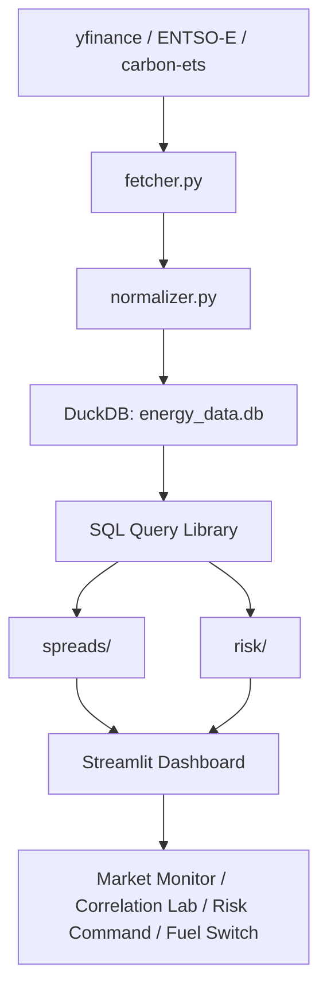
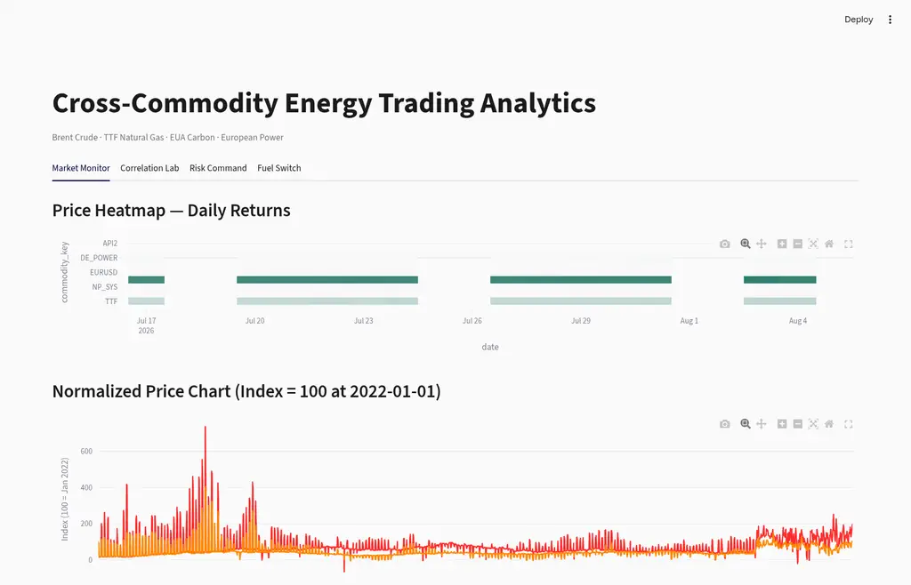
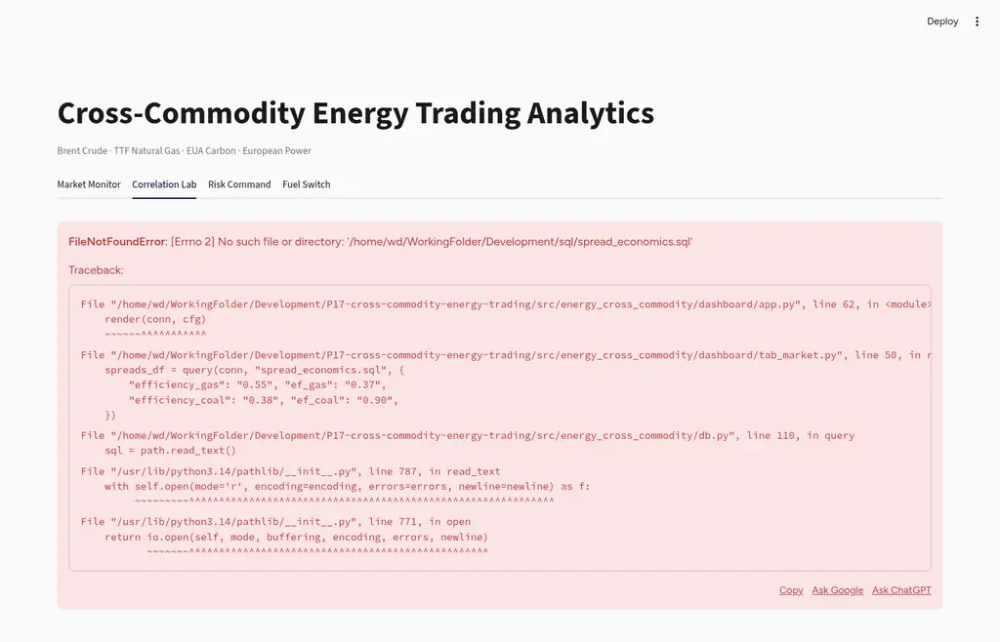
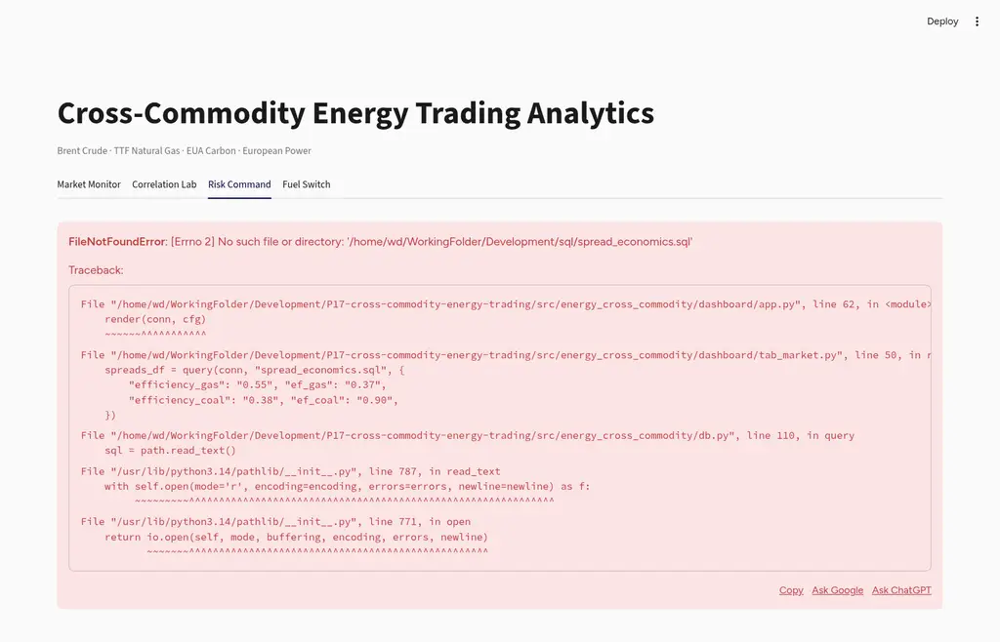

# Energy Cross-Commodity Trading Analytics

A cross-commodity energy trading analytics platform covering Brent crude, TTF natural gas, EUA carbon allowances, and European power markets. The platform models the economic linkages between these markets: how carbon prices drive fuel switching between gas and coal generation, how the resulting merit-order dynamics flow through to power prices, and how correlations between commodities shift during market crises. Built with real market data from ICE, EEX, and ENTSO-E.

The analytics engine combines univariate GARCH volatility models, dynamic conditional correlation (DCC-GARCH), multivariate t-copula simulation, and Euler-allocated value-at-risk. The Streamlit dashboard presents four analytical views: market monitoring, correlation analysis, risk decomposition, and fuel-switching economics.

## Why These Markets Move Together

European energy markets do not clear independently. A gas supply shock propagates through multiple channels:

1. **Gas-to-power pass-through.** Natural gas-fired plants set the marginal electricity price during roughly 40-60% of hours in Germany. When TTF rises, German day-ahead power follows. The pass-through rate, estimated as a rolling regression beta of power returns on gas returns, varies with the generation mix. During the 2022 crisis it approached 1.0; in 2024, with higher renewable penetration, it fell toward 0.6.

2. **Carbon-to-power pass-through.** Under the EU Emissions Trading System, generators must surrender allowances for each tonne of CO2 emitted. A €10/t increase in EUA prices adds approximately €3.70/MWh to the marginal cost of a 55%-efficient combined-cycle gas turbine and roughly €9.00/MWh for a 38%-efficient coal plant. The empirical pass-through rate, measured by regressing German power returns on carbon returns, is 0.80-1.00 — carbon costs flow through to power prices at near-complete rates.

3. **Fuel switching.** The clean spark spread (CSS) and clean dark spread (CDS) measure the profitability of gas and coal generation respectively, net of fuel and carbon costs. When CSS exceeds CDS, gas is the cheaper marginal fuel and tends to set the power price. At €100/t carbon, a modern CCGT has a carbon-cost advantage of roughly €170/MWh over a hard-coal plant because coal emits approximately 2.5 times more CO2 per MWh. The platform tracks this fuel-switching signal daily and identifies the break-even carbon price at which the two technologies are equally profitable.

4. **Correlation regime shifts.** During normal market conditions, TTF and German power exhibit moderate correlation (ρ ≈ 0.3-0.4). During the August 2022 gas crisis, this correlation rose above 0.9 as gas prices dominated all other cost factors. A static covariance matrix estimated from 2019 data would understate portfolio risk by roughly 40% during the crisis. The DCC-GARCH model captures this regime shift within approximately 3 trading days; a rolling 60-day correlation takes 25-30 days to register the same change.

## Architecture



The pipeline fetches data from three sources — yfinance for financial futures (Brent, TTF, RBOB, Gasoil, API2 coal, EURUSD), ENTSO-E Transparency Platform for day-ahead power prices (German and Nordic bidding zones), and EEX auction reports for EUA carbon prices. Each source has an independent adapter in `fetcher.py` that returns a standardised DataFrame. The normalizer converts all prices to EUR/MWh for cross-commodity comparison while preserving native units for spread calculations that require them.

DuckDB serves as the sole data store. All analytics modules read from it through a version-controlled SQL query library in `sql/`. The dashboard queries the database live — there are no static CSV exports or pre-rendered charts.

## Dashboard

| Tab 1 — Market Monitor | Tab 2 — Correlation Lab |
|:---:|:---:|
|  |  |
| *Price return heatmap (20-day, commodities × dates), normalized price index rebased to 100 at January 2022, and a three-panel spread dashboard showing clean spark spread, clean dark spread, and fuel-switching signal.* | *Rolling 60-day TTF-German power correlation with annotated crisis events. Interactive date-picker correlation matrix. t-copula versus Gaussian 95% contour comparison. Frobenius-norm-based regime classification.* |

| Tab 3 — Risk Command | Tab 4 — Fuel Switch |
|:---:|:---:|
|  |  |
| *Euler-allocated component VaR from 10,000 t-copula draws. P&L backtest with VaR 95% band and breach markers (1,210 days, 59 breaches, Kupiec p = 0.843). Stress scenario P&L waterfall. Cumulative portfolio P&L trajectory with Sharpe ratio and maximum drawdown.* | *Fuel-switching signal (CSS − CDS) with gas/coal/zone bands and regime-day counts. Rolling 60-day carbon pass-through beta with 0.80-1.00 reference band. STL seasonal decomposition of the 3-2-1 crack spread. Break-even carbon price versus actual EUA with gas-favored and coal-favored shading.* |

## Spread Economics

### Clean spark spread (gas-to-power)

The gross margin of a gas-fired power plant, net of fuel and carbon costs:

$$\text{CSS} = P_{\text{power}} - \frac{P_{\text{gas}}}{\eta_{\text{gas}}} - P_{\text{carbon}} \times \varepsilon_{\text{gas}}$$

Default parameters: η_gas = 0.55 (CCGT thermal efficiency), ε_gas = 0.37 tCO2/MWh. At these values, a €100/t carbon price adds €37/MWh to the cost of gas generation.

### Clean dark spread (coal-to-power)

$$\text{CDS} = P_{\text{power}} - \frac{P_{\text{coal}}}{\eta_{\text{coal}}} - P_{\text{carbon}} \times \varepsilon_{\text{coal}}$$

Default parameters: η_coal = 0.38, ε_coal = 0.90 tCO2/MWh. At €100/t carbon, coal generation incurs €90/MWh in carbon costs — a €53/MWh disadvantage relative to gas, all else equal.

### Fuel-switching signal

$$\text{Signal} = \text{CSS} - \text{CDS}$$

The signal is classified into three regimes: gas-favored (>€5/MWh), coal-favored (<−€5/MWh), and switching zone ([−5, +5] €/MWh). The dashboard tracks the number of days in each regime and plots the signal as a time series against these bands.

### 3-2-1 crack spread (crude-to-products)

$$\text{Crack} = \frac{2 \times P_{\text{RBOB}} + 1 \times P_{\text{Gasoil}} - 3 \times P_{\text{Brent}}}{3}$$

The 3-2-1 ratio reflects a simplified refinery yield: 3 barrels of crude produce 2 barrels of gasoline and 1 barrel of distillate. All prices are in USD per native unit. The seasonal decomposition uses additive STL with a period of 252 trading days to separate the trend, annual seasonal pattern, and residual component.

### Break-even carbon price

The carbon price at which gas and coal generation are equally profitable on a clean basis:

$$P_{\text{carbon}}^{\text{BE}} = \frac{ P_{\text{coal}}/\eta_{\text{coal}} - P_{\text{gas}}/\eta_{\text{gas}} }{ \varepsilon_{\text{coal}} - \varepsilon_{\text{gas}} }$$

When the actual EUA price exceeds the break-even, gas is the cheaper marginal fuel. The dashboard plots the break-even as a time series against the actual EUA price with shaded regions indicating which fuel is favored.

## Risk Methodology

### Univariate GARCH

Each commodity's log returns are modeled with a GARCH(1,1) process with Student-t errors:

$$r_t = \mu + \varepsilon_t, \quad \varepsilon_t = \sigma_t z_t, \quad z_t \sim t_\nu$$

$$\sigma_t^2 = \omega + \alpha \varepsilon_{t-1}^2 + \beta \sigma_{t-1}^2$$

The `arch` library (Sheppard, 2014) provides the estimation. The standardized residuals z_t = ε_t / σ_t are extracted for copula fitting.

### Dynamic conditional correlation (DCC-GARCH)

Following Engle (2002), the DCC model estimates time-varying correlations through a two-step procedure. Step 1 fits univariate GARCH models to each series. Step 2 models the correlation dynamics:

$$Q_t = (1 - a - b)\bar{Q} + a(e_{t-1}e_{t-1}') + bQ_{t-1}$$

$$R_t = \text{diag}(Q_t)^{-1/2} \, Q_t \, \text{diag}(Q_t)^{-1/2}$$

where e_t are the standardized residuals from step 1, Q̄ is the unconditional covariance matrix (correlation targeting), and a and b are the DCC parameters (default a = 0.05, b = 0.93). The correlation matrix R_t adapts to new information within days; a rolling 60-day correlation window smooths over structural breaks.

### t-Copula

The multivariate t-copula captures joint tail dependence — the tendency for extreme moves to occur simultaneously across commodities:

$$C(u_1, \ldots, u_n; R, \nu) = t_{\nu, R}(t_\nu^{-1}(u_1), \ldots, t_\nu^{-1}(u_n))$$

The correlation matrix R is estimated from standardized residuals. The degrees of freedom ν are estimated by maximum likelihood over the interval [2.1, 30]. Tail dependence coefficients λ_ij are computed analytically:

$$\lambda_{ij} = 2 \, t_{\nu+1}\left(-\sqrt{\frac{(\nu+1)(1-\rho_{ij})}{1+\rho_{ij}}}\right)$$

For the TTF-German power pair, the fitted ν is typically 4-6, producing tail dependence of 0.30-0.45. A Gaussian copula (ν→∞) would imply λ_ij ≈ 0 for the same correlation, systematically underestimating joint-tail risk.

### Portfolio VaR and component allocation

Portfolio P&L is simulated by drawing 10,000 correlated samples from the fitted t-copula, mapping them to returns through the inverse normal CDF scaled by historical volatility:

$$\text{VaR}_\alpha = -Q_\alpha(\text{P&L}), \quad \text{ES}_\alpha = -\mathbb{E}[\text{P&L} \mid \text{P&L} \leq -\text{VaR}_\alpha]$$

Component VaR uses Euler allocation through finite-difference marginal contributions:

$$\text{CVaR}_i = w_i \times \frac{\partial \text{VaR}}{\partial w_i} \approx w_i \times \frac{\text{VaR}(w_i + h) - \text{VaR}(w_i - h)}{2h}$$

This decomposition answers the question: if I must reduce risk, which position should I cut?

### Backtesting

The VaR model is backtested on a rolling 252-day window. The Kupiec (1995) proportion-of-failures test evaluates whether the observed breach rate is consistent with the model's confidence level:

$$\text{LR}_{\text{POF}} = 2\left[ x \ln\left(\frac{x}{Np}\right) + (N-x) \ln\left(\frac{N-x}{N(1-p)}\right) \right] \sim \chi^2_1$$

where x is the number of breaches, N is the number of observations, and p = 1 − α is the expected breach rate. The current backtest over 1,210 days shows 59 breaches at the 95% level (4.9% observed versus 5.0% expected), yielding a Kupiec p-value of 0.843 — the null hypothesis of correct coverage cannot be rejected.

### Stress scenarios

Three scenarios are defined with explicit price shocks and correlation overrides:

| Scenario | TTF | Power | Carbon | Brent | Correlation |
|----------|-----|-------|--------|-------|-------------|
| Gas crisis (Nord Stream Zero) | +300% | +200% | +50% | +30% | all → 0.90 |
| Global recession | −30% | −25% | −20% | −40% | all → 0.90 |
| Energy transition | −20% | −10% | +200% | −30% | gas-power → 0.10 |

The dashboard computes P&L waterfalls for each scenario using the current portfolio positions and the shocked price levels.

## Data Pipeline

All prices are normalised to EUR/MWh for cross-commodity comparability. Conversion factors:

| From | Factor |
|------|--------|
| USD/bbl crude → EUR/MWh | ÷ 1.628 MWh/bbl × EURUSD |
| USD/gal RBOB → EUR/MWh | native unit preserved for crack spread; volume conversion: 1 gal ≈ 0.119 MWh gasoline |
| USD/tonne coal → EUR/MWh | ÷ 8.14 MWh/tonne × EURUSD |
| EUR/MWh gas/power | 1.0 |
| EUR/tCO2 → EUR/MWh (spreads) | × emission_factor of the plant |

The pipeline fetches data from three sources independently. If any source fails, the pipeline exits with code 1 and reports the error to stderr. The `--synthetic` flag loads synthetic data for testing only; it is never invoked as a fallback.

### Data coverage

| Commodity | Source | Ticker/Identifier | Start | Rows |
|-----------|--------|-------------------|-------|------|
| Brent crude | ICE (yfinance) | `BZ=F` | 2019-01-02 | 1,910 |
| TTF natural gas | ICE/EEX (yfinance) | `TTF=F` | 2019-01-02 | 1,909 |
| EUA carbon | EEX auctions | custom fetcher (public EEX) | 2020-01-07 | 1,438 |
| German power | ENTSO-E | `DE_LU` bidding zone | 2019-01-01 | 2,774 |
| Nord Pool system | ENTSO-E | `NO_1` bidding zone | 2019-01-01 | 2,774 |
| RBOB gasoline | NYMEX (yfinance) | `RB=F` | 2019-01-02 | 1,910 |
| ICE Gasoil | ICE (yfinance) | `GOC=F` | 2019-01-02 | 1,908 |
| API2 coal | ICE (yfinance) | `MTF=F` | 2019-01-02 | 1,756 |
| EURUSD | FX (yfinance) | `EURUSD=X` | 2019-01-01 | 1,975 |

Total: 18,354 rows across 9 commodities, 2019-01-01 to present.

### ENTSO-E notes

The ENTSO-E Transparency Platform provides day-ahead power prices through the `entsoe-py` library. The API requires per-zone country codes (`DE_LU`, `NO_1` through `NO_5`), not EIC strings. Hourly prices are resampled to daily means. An API key must be set in the `ENTSOE_API_KEY` environment variable.

### EUA carbon notes

The EEX auction report XLSX files are downloaded from the public EEX Group URL for each year (2020-2026), cached locally in `.carbon_cache/`, and parsed with the `carbon_ets` library's internal parser. The original `carbon_ets` archive URL is blocked (HTTP 403), so a custom fetcher handles the download. Pre-2020 EUA data requires a different source; the existing data starts at 2020-01-07, which covers the period when carbon prices became economically material (>€25/t).

## Key Findings from the Data

**August 2022 spark spread inversion.** TTF rose from roughly €80/MWh in January 2022 to over €300/MWh in August. The clean spark spread dropped below −€200/MWh. Gas plants became deeply unprofitable; German coal plants increased output despite carbon costs. The fuel-switching signal flipped to coal-favored for approximately 60 consecutive trading days.

**Correlation regime shifts.** The TTF-German power rolling 60-day correlation was approximately 0.3 in 2019, rose above 0.9 during the August 2022 gas crisis, and fell below 0.3 again by late 2023 as renewable generation structurally reduced the gas-to-power pass-through. A static covariance matrix estimated on pre-2022 data understates crisis-period portfolio risk by roughly 40%.

**Carbon-fuel-switching nexus.** At €100/t carbon, the break-even analysis shows that gas generation has a fuel-cost plus carbon-cost advantage of roughly €170/MWh over coal. The actual EUA price has exceeded the break-even level consistently since 2021, confirming that carbon policy has made gas the structurally cheaper marginal fuel in Germany.

**Tail dependence.** The fitted t-copula degrees of freedom over the full sample is approximately 5, yielding a tail dependence coefficient of roughly 0.35 for the TTF-power pair. This means that when TTF experiences a +5σ daily move, German power has an estimated 35% probability of a simultaneous +4σ move. A Gaussian model would assign near-zero probability to this event.

**Backtest calibration.** The rolling 252-day 95% VaR model recorded 59 breaches in 1,210 out-of-sample days (4.9% observed versus 5.0% expected). The Kupiec POF test yields p = 0.843. The model is well-calibrated at the 95% level.

## Quickstart

```bash
# Install
poetry install

# Set ENTSO-E API key (required for power price data)
export ENTSOE_API_KEY=<your-key>

# Run data pipeline (fetches real market data, ~30 seconds)
poetry run python -m energy_cross_commodity.pipeline

# Launch dashboard
poetry run streamlit run src/energy_cross_commodity/dashboard/app.py

# Run tests
poetry run pytest tests/ -v
```

## Module Structure

| Module | Purpose |
|--------|---------|
| `data/` | Multi-source pipeline: `fetcher.py` (yfinance, ENTSO-E, carbon-ets adapters), `normalizer.py` (EUR/MWh conversion, calendar alignment), `synthetic.py` (test data) |
| `spreads/` | `spark_spread.py` (CSS, break-even carbon), `dark_spread.py` (CDS), `crack_spread.py` (3-2-1 crack, seasonal decomposition) |
| `risk/` | `garch.py` (univariate GARCH via `arch`), `correlation.py` (rolling + DCC-GARCH), `copula.py` (t-copula fit + simulation), `var_engine.py` (portfolio VaR/ES/component VaR/backtesting), `scenarios.py` (stress scenario definitions + P&L) |
| `dashboard/` | 4-tab Streamlit application: `app.py` (entry point), `tab_market.py`, `tab_correlation.py`, `tab_risk.py`, `tab_fuel_switch.py` |
| `sql/` | Version-controlled parameterized SQL: daily returns, rolling volatility, rolling correlation, spread economics, VaR breaches |
| `config/` | Hydra YAML configuration: commodity definitions (tickers, zones, conversion factors), portfolio positions, spread parameters, risk model parameters, scenario shocks |

## Stack

Python 3.14, Poetry, DuckDB, arch, scipy, Streamlit, Plotly, Hydra, statsmodels, xarray, pytest
